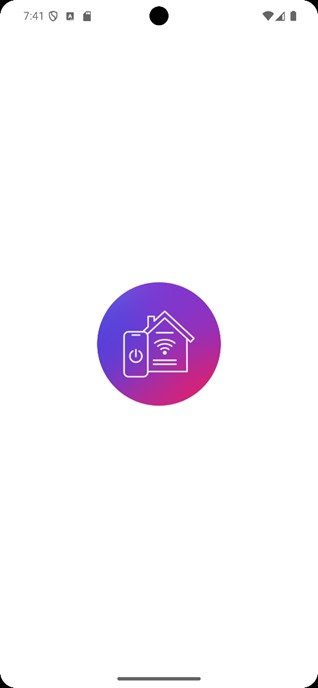
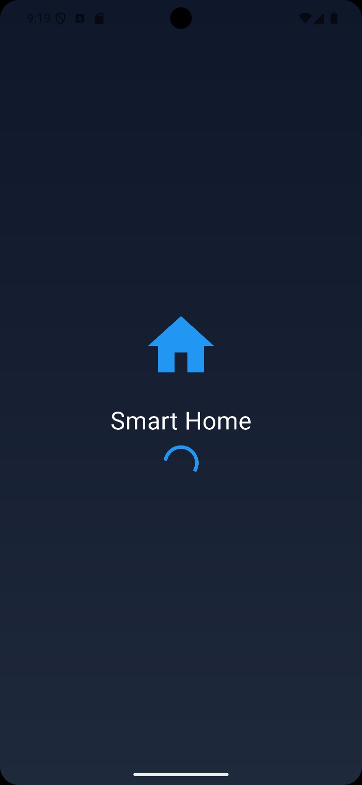
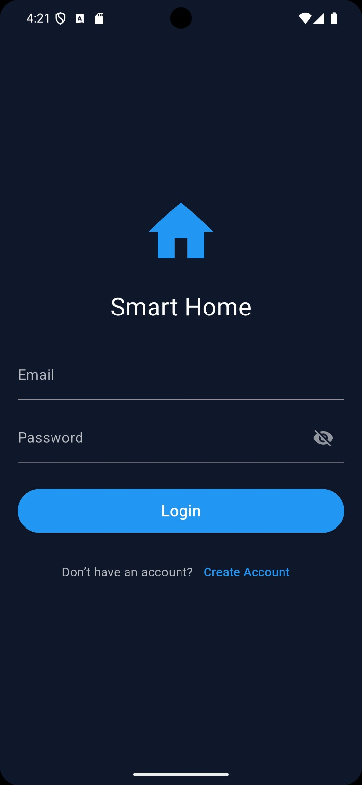
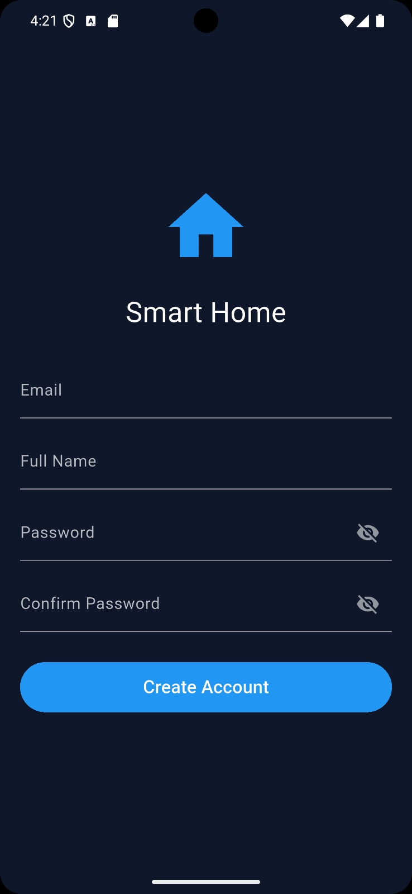
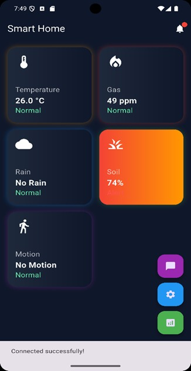
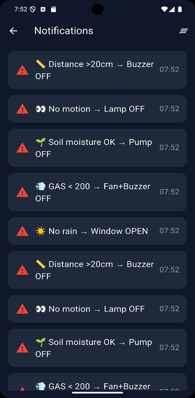
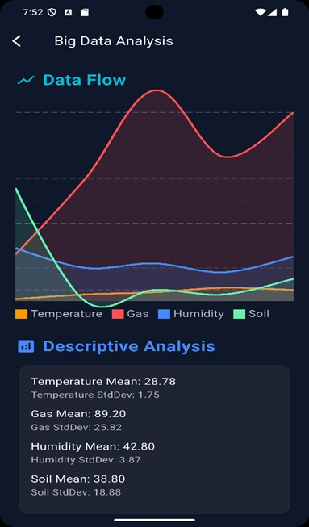
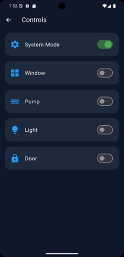

# 🏠 Smart Home IoT AI System

An intelligent **Smart Home IoT platform** powered by **Big Data Analytics** and **Machine Learning**.  
This system enables **real-time monitoring**, **predictive automation**, and **anomaly detection** to create a safer, smarter, and more energy‑efficient living environment.

---

## 🚀 Key Features
- **Real-time Monitoring**: Track sensors (temperature, humidity, gas, motion, rain) instantly.
- **Predictive Automation**: Automatically control devices based on user behavior and sensor data.
- **Anomaly Detection**: Identify unusual events (e.g., gas leaks, overheating) and send alerts.
- **AI Assistant**: Natural language interaction in English & Arabic for smart control.
- **Supabase Integration**: Cloud database for secure storage and analytics.
- **Flutter UI**: Modern, responsive mobile interface.
- **Python Backend**: AI models and device control logic.

---

## 🧠 Tech Stack
- **Frontend**: Flutter (Dart)
- **Backend**: Python + Flask
- **Database**: Supabase (PostgreSQL)
- **Protocols**: MQTT for IoT communication
- **AI Models**: Machine Learning for anomaly detection & predictive analytics

---

## 📂 Project Structure
lib/
└── screens/
└── ChatPage.dart       # Smart AI assistant interface
└── ControlsPage.dart   # Device control dashboard
└── SensorsPage.dart    # Sensor data visualization
backend/
└── app.py                   # Python Flask API
datasets/
└── smart_home_sensors.csv   # Sensor dataset for analytics

---

## 🔗 Useful Links
- [GitHub Repository](https://github.com/MostafaAhmedSabry/Smart_Home_Iot.git)
- [Supabase Project](https://your-project-id.supabase.co)
- [Google Drive](https://drive.google.com/drive/folders/your-folder-id)

---

## 📸 Screenshots

  
  
  
  

ر

  
  
  
  

ر

  
  

---

## 🏆 Academic Value
This project demonstrates practical applications of:
- **Big Data Analytics**  
- **IoT Security**  
- **AI-powered Smart Systems**  

It serves as a strong academic project for **Software Engineering & Data Analytics** programs.

